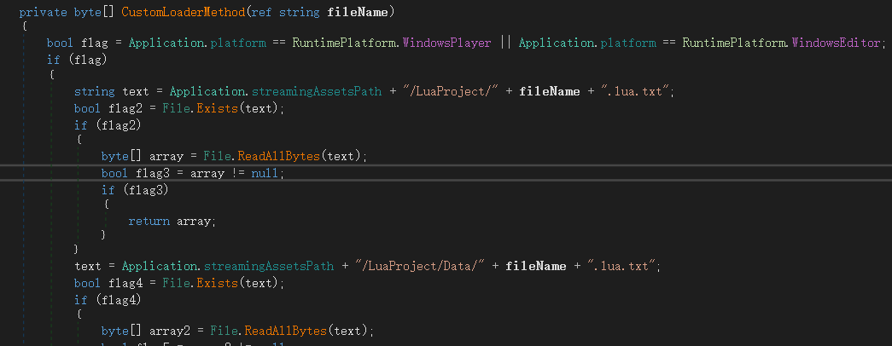

具体分析过程懒得再复现一边了,这边直接记录结果,和相关操作

使用[dnspy](https://github.com/dnSpyEx/dnSpy/)分析DreamRivakes_Data\Managed\GameApp.dll可知,游戏会先尝试从本地Resources文件夹内加载lua脚本,如果不存在则再去资源包内加载

使用[AssetStudio](https://github.com/aelurum/AssetStudio/releases) 解包游戏(按文件夹分类导出),将解包出来的luaproject文件夹,移动到DreamRivakes_Data\Resources内

